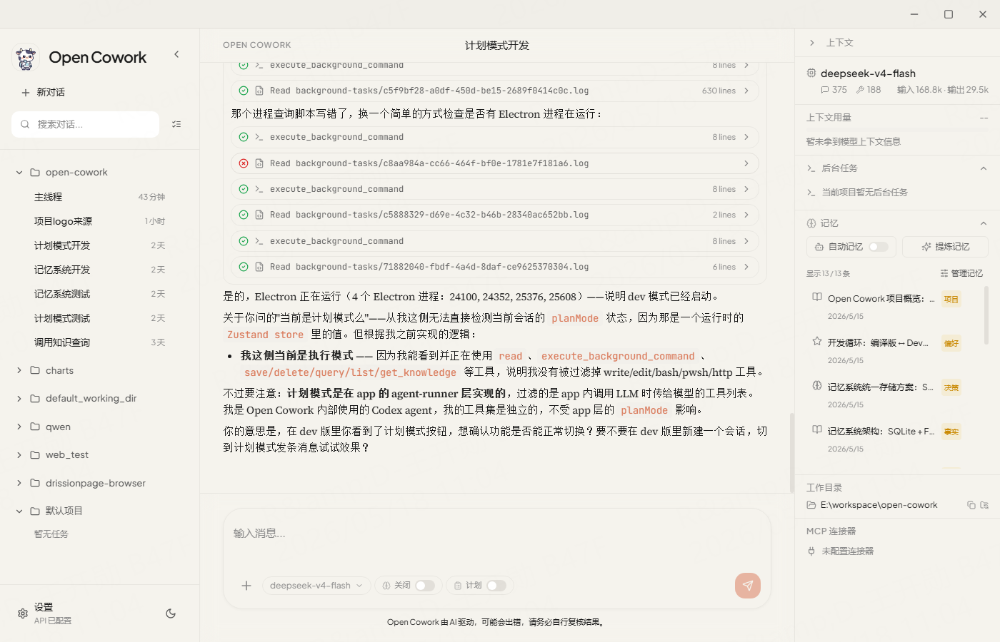

<p align="center">
  
</p>

<h1 align="center">Open Cowork</h1>

<p align="center">开源的 AI Agent 桌面应用，支持 Windows / macOS 一键安装</p>

<p align="center">
  <a href="README.md">中文</a> · <a href="README.en.md">English</a>
</p>

<p align="center">
  
  
  <a href="https://discord.gg/pynjtQDf"></a>
</p>

---

Open Cowork 将 Claude Code、OpenAI、Gemini、DeepSeek 等 AI 模型封装为图形界面，提供虚拟机级别的沙盒隔离（Windows 使用 WSL2，macOS 使用 Lima）、内置 Skills 技能系统（PPTX/DOCX/XLSX/PDF 生成）、MCP 协议集成、内置知识记忆系统（项目级去重/合并/跨会话隔离）、双模式 Agent，以及通过飞书/Slack 进行远程控制。

> [!WARNING]
> Open Cowork 是 AI 协作工具，请对文件修改、删除等操作保持谨慎。VM 沙盒可隔离大多数风险，但仍需自行审查关键操作。
> 
> MIT没有广告法，所以Open Cowork就是最好用的桌面Agent工具！！！。
---

## 界面预览

<p align="center">
  
</p>

---

## 架构

```
open-cowork/
├── src/
│   ├── main/                  # Electron 主进程 (Node.js)
│   │   ├── background/        # 后台任务管理 (dev server 等长时进程)
│   │   ├── claude/            # Agent 执行引擎
│   │   ├── config/            # 配置持久化
│   │   ├── db/                # SQLite 数据层
│   │   ├── ipc/               # IPC 处理器
│   │   ├── mcp/               # MCP 协议集成
│   │   ├── memory/            # 知识记忆系统 (去重/合并/跨会话隔离)
│   │   ├── remote/            # 飞书 / Slack 远程控制
│   │   ├── sandbox/           # 沙盒隔离 (WSL2 / Lima)
│   │   ├── session/           # 会话与上下文管理
│   │   └── skills/            # 技能加载与管理
│   ├── preload/               # Electron 上下文桥接
│   └── renderer/              # 前端 UI (React + Tailwind)
│       ├── components/        # UI 组件
│       ├── hooks/             # React Hooks
│       └── store/             # Zustand 状态管理
└── .claude/skills/            # 内置技能 (pptx / docx / pdf / xlsx)
```

**技术栈**：Electron · React 18 · TypeScript · Vite · Tailwind CSS · Zustand · better-sqlite3 (含 FTS5 全文检索)

**Agent 模式**：

| 模式 | 说明 | 行为约束 |
|------|------|----------|
| **编辑模式**（默认） | 正常执行模式 | 可读取、搜索、编辑文件、执行命令、创建文件 |
| **计划模式** | 分析与计划模式 | 仅允许读取、搜索、只读命令，禁止修改源文件 |

Agent 通过每轮运行时注入的 `<current_mode>` 区域感知当前模式，并由工具执行层强制拦截写操作。计划模式适合在需要安全审查、调研分析或制定变更方案时使用。

**沙盒隔离**：
| 级别 | 平台 | 实现 |
|------|------|------|
| 基础 | 全平台 | 路径守卫，操作限制在工作区内 |
| 增强 | Windows | WSL2，命令在隔离 Linux VM 中执行 |
| 增强 | macOS | Lima，命令在隔离 Linux VM 中执行 |

---

## 安装

**macOS（推荐）**

```bash
brew tap SageFoundry/tap
brew install --cask --no-quarantine open-cowork
```

**Windows / macOS 安装包**：从 [Releases](https://github.com/SageFoundry/open-cowork/releases) 下载对应平台安装包。

**源码运行**

```bash
git clone https://github.com/SageFoundry/open-cowork.git
cd open-cowork
npm install
npm run rebuild
npm run dev
```

打包：`npm run build`

---

## 快速开始

### 1. 获取 API Key

| 服务商 | Base URL | 推荐模型 |
|--------|----------|----------|
| [Anthropic](https://console.anthropic.com/) | 默认 | `claude-sonnet-4-6` |
| [OpenAI](https://platform.openai.com/) | `https://api.openai.com/v1` | `gpt-5.5` |
| [DeepSeek](https://platform.deepseek.com/) | `https://api.deepseek.com` | `deepseek-v4-pro` |
| [智谱 GLM](https://bigmodel.cn/glm-coding) | `https://open.bigmodel.cn/api/anthropic` | `glm-5.1` |
| [MiniMax](https://platform.minimaxi.com/subscribe/coding-plan) | `https://api.minimaxi.com/anthropic` | `minimax-m2.7` |
| [Kimi](https://www.kimi.com/membership/pricing) | `https://api.kimi.com/coding/` | `kimi-k2.6` |

### 2. 配置应用

打开应用 → 左下角 ⚙️ 设置 → 填入 API Key、Base URL、Model 名称。

### 3. 选择工作区并开始

选择一个文件夹作为工作区，然后在对话框中输入指令即可。

---

## License

MIT © Open Cowork Team
